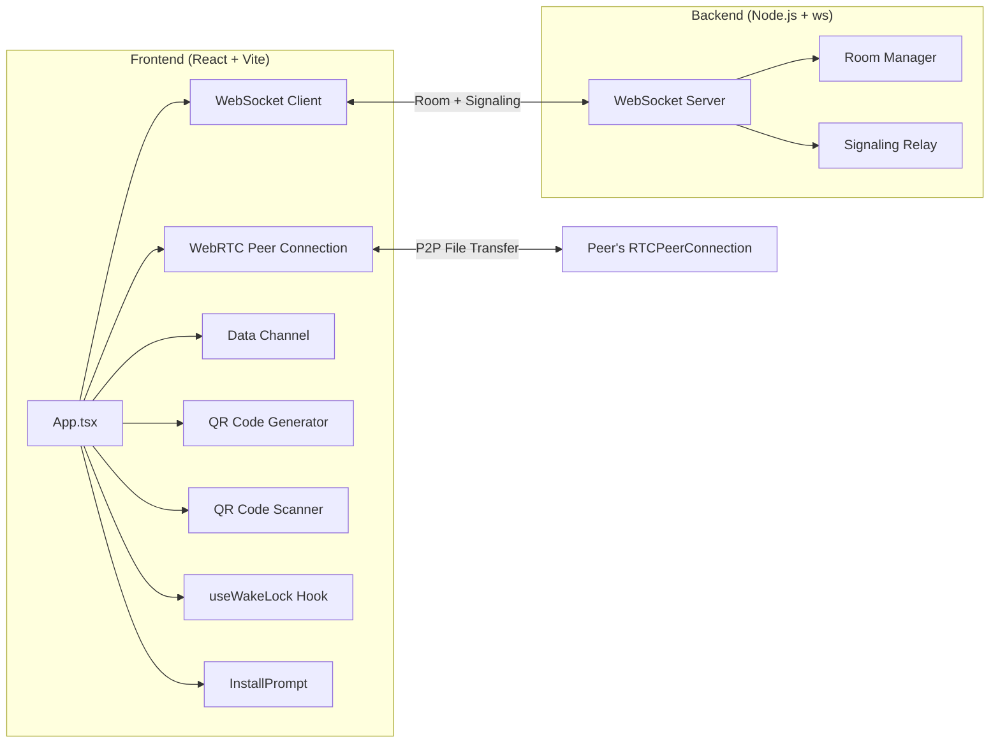
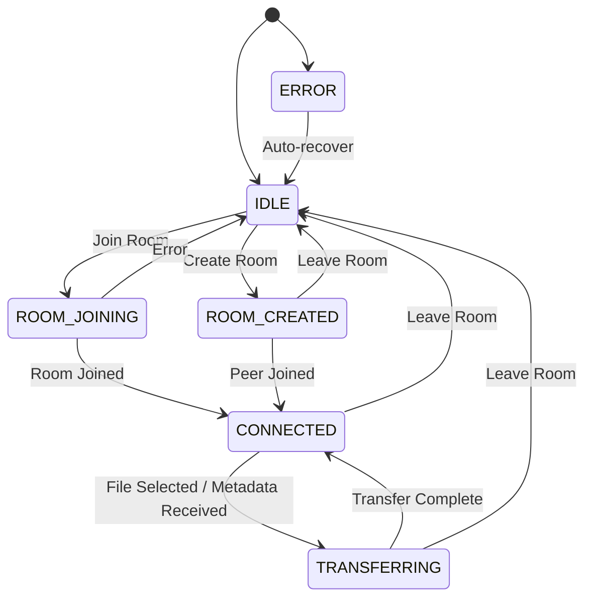

<div align="center">

# ⚡ Fusion Share

### Cross-device file sharing — instant, private, peer-to-peer

[](https://www.typescriptlang.org/)
[](https://react.dev/)
[](https://vitejs.dev/)
[](https://webrtc.org/)
[](https://web.dev/progressive-web-apps/)

<br/>

**Share files between any two devices on any network — no uploads, no cloud, no accounts.**

Files travel directly between browsers via WebRTC. The server only handles room creation and signaling — **your data never touches it.**

<br/>

</div>

---

## 📋 Table of Contents

- [How It Works](#-how-it-works)
- [Features](#-features)
- [Architecture](#-architecture)
- [Tech Stack](#-tech-stack)
- [Project Structure](#-project-structure)
- [Getting Started](#-getting-started)
- [Usage](#-usage)
- [Transfer Protocol](#-transfer-protocol)
- [PWA Support](#-pwa-support)
- [Wake Lock](#-wake-lock)
- [Configuration](#-configuration)
- [Browser Support](#-browser-support)
- [Contributing](#-contributing)
- [License](#-license)

---

## 🔍 How It Works

```
┌──────────┐        WebSocket         ┌──────────┐        WebSocket         ┌──────────┐
│  Sender  │ ───── Signaling Only ──▶ │  Server  │ ◀── Signaling Only ──── │ Receiver │
│ (Browser)│                          │ (Node.js)│                          │ (Browser)│
└────┬─────┘                          └──────────┘                          └────┬─────┘
     │                                                                           │
     │                    WebRTC DataChannel (Peer-to-Peer)                       │
     └───────────────── File chunks travel directly ─────────────────────────────┘
```

1. **Sender** creates a room → gets a 4-character code  
2. **Receiver** joins with the code (manual entry, QR scan, or shareable link)  
3. Server brokers the WebRTC handshake (offer → answer → ICE candidates)  
4. Once connected, files transfer **directly between browsers** — the server is no longer involved  
5. Files are split into 16KB chunks, sent sequentially with acknowledgment per chunk  
6. Receiver auto-downloads the complete file when all chunks arrive  

---

## ✨ Features

| Feature | Description |
|---|---|
| **🔒 Peer-to-Peer Transfer** | Files go directly between devices via WebRTC — no cloud upload |
| **📱 QR Code Join** | Sender shows a QR code; receiver scans to join instantly |
| **🔗 Shareable Link** | URL with `?room=CODE` enables one-tap joining |
| **📦 Chunked Transfer** | Files split into 16KB chunks with per-chunk ACK for reliability |
| **🔄 Resume Support** | Interrupted transfers can resume from the last acknowledged chunk |
| **📲 Installable PWA** | Add to home screen on iOS, Android, and desktop for an app-like experience |
| **🔋 Wake Lock** | Screen stays awake during transfers to prevent interruptions on mobile |
| **🎨 Modern UI** | Dark theme with glassmorphism, gradient accents, and smooth animations |
| **⚡ Zero Dependencies Runtime** | No heavy frameworks — just React, TypeScript, and browser APIs |

---

## 🏗 Architecture

### System Overview



### State Machine

The app follows an explicit state machine with 6 states:



---

## 🛠 Tech Stack

### Frontend
| Technology | Purpose |
|---|---|
| **React 18** | UI rendering with hooks-based architecture |
| **TypeScript 5.3** | Type safety across the entire codebase |
| **Vite 5** | Dev server + HMR + production bundling |
| **WebRTC API** | Peer-to-peer data channel for file transfer |
| **Wake Lock API** | Prevents screen lock during active transfers |
| **qrcode** | QR code generation for room sharing |
| **html5-qrcode** | Camera-based QR code scanning |
| **Service Worker** | Static asset caching for PWA support |

### Backend
| Technology | Purpose |
|---|---|
| **Node.js** | Runtime environment |
| **ws** | Lightweight WebSocket server |
| **TypeScript 5.3** | Type-safe server code |
| **tsx** | Dev-mode TypeScript execution with watch |

---

## 📁 Project Structure

```
Fusion Share/
├── backend/
│   ├── src/
│   │   └── index.ts              # WebSocket server — room management + signaling relay
│   ├── package.json
│   └── tsconfig.json
│
├── frontend/
│   ├── public/
│   │   ├── icon.svg              # App icon (SVG)
│   │   ├── manifest.json         # PWA web app manifest
│   │   └── service-worker.js     # Static asset caching service worker
│   ├── src/
│   │   ├── components/
│   │   │   └── InstallPrompt.tsx  # "Add to Home Screen" prompt (iOS + Android)
│   │   ├── hooks/
│   │   │   └── useWakeLock.ts     # Wake Lock API hook for screen-awake during transfers
│   │   ├── App.tsx                # Main app — state machine, WebRTC, transfer logic, UI
│   │   ├── App.css                # Complete styling — dark theme, glassmorphism, animations
│   │   └── main.tsx               # Entry point — React root + service worker registration
│   ├── index.html                 # HTML shell with PWA meta tags
│   ├── vite.config.ts
│   ├── package.json
│   └── tsconfig.json
```

---

## 🚀 Getting Started

### Prerequisites

- **Node.js** ≥ 18
- **npm** ≥ 9

### Installation

```bash
# Clone the repository
git clone https://github.com/your-username/fusion-share.git
cd fusion-share

# Install backend dependencies
cd backend
npm install

# Install frontend dependencies
cd ../frontend
npm install
```

### Running Locally

You need **two terminals** — one for the backend, one for the frontend:

**Terminal 1 — Backend (WebSocket Server)**
```bash
cd backend
npm run dev
# ✅ WebSocket server running on port 8080
```

**Terminal 2 — Frontend (Vite Dev Server)**
```bash
cd frontend
npm run dev
# ✅ Frontend running on http://localhost:5180
```

Open `http://localhost:5180` in your browser. To test file sharing, open a second browser tab or use another device on the same network via `http://<your-ip>:5180`.

### Production Build

```bash
# Build backend
cd backend
npm run build
npm start

# Build frontend
cd frontend
npm run build
npm run preview
```

---

## 📖 Usage

### Sending a File

1. Open the app and click **Create Room**
2. Share the **4-character room code** with the receiver (show the QR code, share the link, or read the code aloud)
3. Wait for the receiver to connect (status shows "WebRTC connected")
4. Click **Select File** and choose a file to send
5. Watch the progress bar — the file is sent directly to the receiver

### Receiving a File

1. Open the app and click **Join Room**
2. Enter the 4-character code, **scan the QR code** 📷, or open the **shared link**
3. The file transfer starts automatically once the sender selects a file
4. The file downloads automatically when the transfer completes

### Resuming Interrupted Transfers

If the connection drops mid-transfer:
- The receiver can request a **resume** from the last acknowledged chunk
- The sender can **retry** sending from where it stopped
- Click the **Resume Transfer** button that appears

---

## 📡 Transfer Protocol

### Message Flow

```
Sender                          Server                         Receiver
  │                               │                               │
  │─── CREATE_ROOM ──────────────▶│                               │
  │◀── ROOM_CREATED (code) ──────│                               │
  │                               │◀── JOIN_ROOM (code) ─────────│
  │◀── PEER_JOINED ─────────────│──── ROOM_JOINED ─────────────▶│
  │                               │                               │
  │─── RTC_OFFER ────────────────▶│──── RTC_OFFER ──────────────▶│
  │                               │◀── RTC_ANSWER ──────────────│
  │◀── RTC_ANSWER ───────────────│                               │
  │◀──────── ICE_CANDIDATE ──────▶│◀──── ICE_CANDIDATE ─────────▶│
  │                               │                               │
  │═══════════ WebRTC DataChannel (direct P2P) ═════════════════│
  │                                                               │
  │─── FILE_META ────────────────────────────────────────────────▶│
  │─── FILE_CHUNK [0] ──────────────────────────────────────────▶│
  │◀── CHUNK_ACK [0] ───────────────────────────────────────────│
  │─── FILE_CHUNK [1] ──────────────────────────────────────────▶│
  │◀── CHUNK_ACK [1] ───────────────────────────────────────────│
  │    ...repeats until all chunks sent...                        │
```

### Data Channel Messages

| Message | Direction | Fields | Description |
|---|---|---|---|
| `FILE_META` | Sender → Receiver | `fileId`, `name`, `size`, `mimeType`, `chunkSize`, `totalChunks` | Metadata sent before transfer begins |
| `FILE_CHUNK` | Sender → Receiver | `fileId`, `index`, `data` (base64) | A single 16KB chunk of the file |
| `CHUNK_ACK` | Receiver → Sender | `fileId`, `index` | Acknowledgment — sender proceeds to next chunk |
| `RESUME_REQUEST` | Receiver → Sender | `fileId`, `lastReceivedChunk` | Request to resume from a specific chunk |

### Design Decisions

- **16KB chunk size** — stays within WebRTC DataChannel buffering limits across browsers
- **Base64 encoding** — ensures reliable JSON serialization of binary data
- **Sequential send with ACK** — prevents buffer overflow and enables resume
- **Memory optimization** — chunks are nullified after acknowledgment to free memory during large transfers

---

## 📲 PWA Support

Fusion Share is a Progressive Web App that can be installed on any device:

| Platform | How to Install |
|---|---|
| **Android (Chrome)** | Automatic install banner appears, or use Menu → "Install app" |
| **iOS (Safari)** | Tap Share → "Add to Home Screen" (guided prompt appears in-app) |
| **Desktop (Chrome/Edge)** | Click the install icon in the address bar |

### What the PWA Provides

- **Standalone app experience** — no browser chrome, full-screen UI
- **Home screen icon** — launch like a native app
- **Service worker caching** — static assets cached for faster load times
- **Smart caching strategy** — Network-first for navigation, cache-first for static assets, no caching for WebSocket/WebRTC traffic

---

## 🔋 Wake Lock

On mobile devices, the screen may lock during long file transfers. Fusion Share uses the **Wake Lock API** to keep the screen awake:

- **Activates** when a transfer starts (sending or receiving)
- **Releases** when the transfer completes, is aborted, or the user leaves the room
- **Visibility-aware** — releases on tab switch, re-acquires when the tab becomes visible again
- **Best-effort** — silently skips on unsupported browsers with no errors or warnings
- **UI indicator** — subtle "Keeping screen awake during transfer" text during active transfers

---

## ⚙️ Configuration

### Backend

| Variable | Default | Description |
|---|---|---|
| WebSocket Port | `8080` | Set in `backend/src/index.ts` |

### Frontend

| Variable | Default | Description |
|---|---|---|
| Dev Server Port | `5180` | Set in `frontend/vite.config.ts` |
| WebSocket URL | `ws://localhost:8080` | Set in `frontend/src/App.tsx` (`connectWebSocket`) |
| Chunk Size | `16KB` | Set in `frontend/src/App.tsx` (`CHUNK_SIZE`) |
| STUN Servers | Google STUN | Set in `frontend/src/App.tsx` (`RTC_CONFIG`) |

### Customizing for Production

For deploying to production, update the WebSocket URL in `App.tsx`:

```typescript
// Change this:
const ws = new WebSocket('ws://localhost:8080');

// To your production URL:
const ws = new WebSocket('wss://your-domain.com');
```

---

## 🌐 Browser Support

| Browser | File Transfer | QR Scanner | Wake Lock | PWA Install |
|---|---|---|---|---|
| **Chrome 80+** | ✅ | ✅ | ✅ | ✅ |
| **Edge 80+** | ✅ | ✅ | ✅ | ✅ |
| **Safari 16+** | ✅ | ✅ | ✅ | ✅ (iOS) |
| **Firefox 90+** | ✅ | ✅ | ❌ | ❌ |
| **Opera** | ✅ | ✅ | ✅ | ✅ |

> **Note:** Wake Lock and PWA install are best-effort features. The app works fully without them.

---

## 🔐 Privacy & Security

- **No server storage** — files are never uploaded to or stored on the server
- **No accounts** — no registration, no cookies, no tracking
- **Peer-to-peer** — data travels directly between browsers via encrypted WebRTC DataChannels (DTLS)
- **Ephemeral rooms** — rooms are destroyed when the sender disconnects
- **In-memory only** — the server keeps rooms in memory; nothing is persisted to disk

---

## 🤝 Contributing

Contributions are welcome! Here's how to get started:

1. **Fork** the repository
2. **Create a branch** — `git checkout -b feature/my-feature`
3. **Make changes** — follow the existing code style (TypeScript strict mode)
4. **Test** — verify both sender and receiver flows work correctly
5. **Submit a PR** — describe what you changed and why

### Development Tips

- The backend is a single `index.ts` file — keep it simple
- The frontend state machine in `App.tsx` is the source of truth for app behavior
- All WebRTC signaling goes through the WebSocket server; the DataChannel is for file data only
- Test with two browser tabs locally, or two devices on the same network

---

## 📄 License

This project is open source and available under the [MIT License](LICENSE).

---

<div align="center">

**Built with ❤️ using WebRTC**

*Share files instantly. No cloud. No limits.*

</div>
